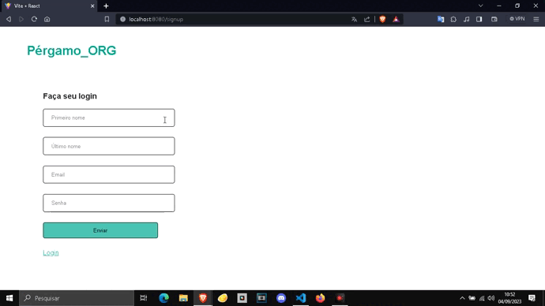
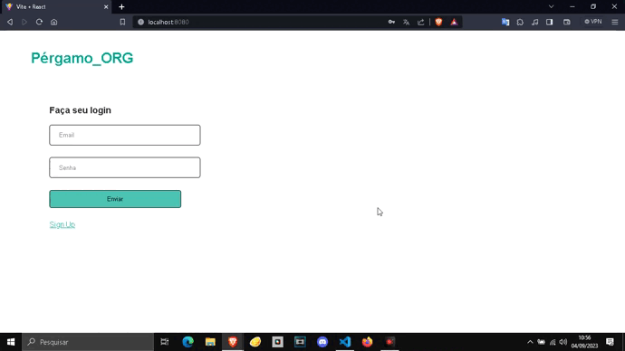

# Sistema de Login e Cadastro - Node e React
O Sistema consiste em uma página para cadastro e login, integrando um front-end feito em React, um back-end em 
Node.js com um banco de dados NoSQL, o MongoDB.
 

# Tecnologias
• React 
• Node.js 
• MongoDB 
• Express 
• Axios 
• Mongoose 
 
# Front-End
O front da aplicação foi feito em React + vite, integrando os React Hooks e bibliotecas importantes como axios e 
react-router-dom.

 
# Back-End
O back-end desse site foi feito com <strong>Node.js</strong>, usando do <strong>Express</strong> para fazer toda 
estrutura de requisições, da biblioteca <strong>Mongoose</strong> para vincular ao banco de dados <strong>MongoDB
</strong> e criar os Schemas e do dotenv para segurança das informações de login do banco de dados.